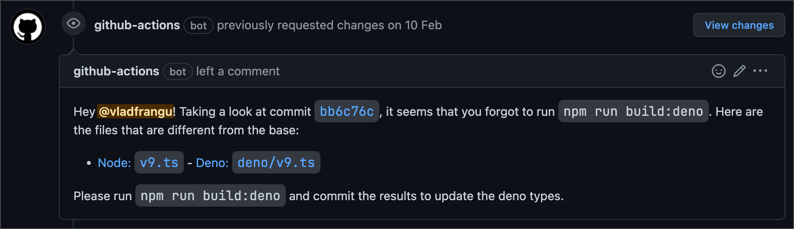

So, you'd like to contribute to `discord-api-types` but don't know where to start or what to do? Here are some of the
things you need to keep in mind before opening a pull request!

:::tip Before you begin

We recommend you contribute either through locally editing the files on your desktop (which means also installing
[`npm`](https://www.npmjs.com/) dependencies as this will ensure not only a consistent code style, but also that the
`deno` types stay in sync automatically) or through a service like
[`GitHub Codespaces`](https://github.com/features/codespaces).

:::

:::info Still can't figure it out?

No problem! We await you with open hands in our [`Discord Server`](https://discord.gg/djs) in the `#developing-djs`
channel.

:::

### Install npm dependencies first

One of the most crucial steps is installing [`npm`](https://www.npmjs.com/) dependencies via `npm ci`. This ensures that
linting can be done, and it also sets up the `git` hooks for building the `deno` types and automatically
formatting/linting the code when you commit it.

If you forget to install [`npm`](https://www.npmjs.com/) dependencies, or are doing the contributions through other
means (like directly from GitHub web), you might see a comment like this one being sent as a review to your pull
request:



The easiest way to solve this is to run the `build:deno` script (`npm run build:deno`) and pushing the results.

### Figure out if the update you want to contribute respects our rules about documentation

:::danger

We will not document client-only / client related types. If you plan on contributing, make sure the types you want to
document can be used by bots and are _intended_ for usage by bots. This is a hard rule that will never change.

:::

Not every single update to the API is valid to be documented here. Our main stance for documentation is that properties
must be known and documented on [`Discord's API Documentation repository`](https://github.com/discord/discord-api-docs),
must be mentioned in an open pull request or must have received the green light to be used.

With that aside, there are times where documentation for certain types is not approved/merged by Discord on the grounds
that `it isn't helpful for bots` (or similar), but it would actually benefit bot developers to have it documented (one
good example is the UserFlags `SPAMMER` flag). As such, if you think your update should still be merged, please propose
it and we will be handled on a case by case basis. If approved, your update will be documented with an `@unstable` tag.
It will also not be subject to the same versioning rules as the rest of the types.

### Figure out what API versions need to receive the update

`discord-api-types` has multiple API versions in the repository, some of which may be considered `deprecated` or
`discontinued` as we keep them till the version is completely dead before removing them. This is a good time to figure
out which API versions need to be updated, and you can use the table below to guide you.

You can also check [`Discord's API versioning table`](https://discord.com/developers/docs/reference#api-versioning) if
you want to be 1000% sure.

| **API Version** | **Should receive updates** |
| :-------------: | :------------------------: |
|       10        |            Yes             |
|        9        |            Yes             |
|        8        |             No             |
|        7        |             No             |
|        6        |             No             |

If the version you want to contribute to is not listed above (for instance if a new API version rolls out) or if the
version you want to contribute to is for a different part of the API (for instance `voice`), feel free to submit it and
we will review it accordingly.

### Figure out where exactly are the files you need to modify to make the update

The file structure might seem confusing at first, especially if it's your first time contributing, but we're here to
guide you through it.

When you clone the repository for the first time, you'll see a folder structure like this (we've not mentioned some
tooling specific files like `.eslintrc.json` to keep the structure clean). We've highlighted the important folders and
files you need to keep in mind when contributing.

```bash {2,4-6,9-10,12-16}
├── deno
├── gateway
├── node_modules (once you ran `npm ci`)
├── payloads
├── rest
├── rpc
├── scripts
├── tests
├── utils
├── voice
├── website
├── globals.ts
├── v6.ts
├── v8.ts
├── v9.ts
├── v10.ts
└── package.json
```

#### `deno`

This folder stores the [`deno`](https://deno.land/) compatible typings for Discord's API.

:::danger

This folder should not be manually modified. Any manual changes will be overwritten by the `build:deno` script.

Any changes that need to be done to this folder need to be done through the `scripts/deno.mjs` file.

:::

#### `gateway`

This folder holds types that are strictly received from
[`Discord's gateway`](https://discord.com/developers/docs/topics/gateway). It stores the gateway version the types are
for, the intents and opcodes, and any data that can be received/sent through the gateway.

Each file in the folder represents a gateway version. It references types from the versioned [`payloads`](#payloads)
folder unless the payloads come _only_ through the gateway. There is also a `common.ts` file which represents shared
types across all versions, as well as an `index.ts` file that exports the recommended gateway version's types.

:::info

Types created here must start with the `Gateway` prefix (for instance `GatewayGuildCreateDispatchData` which is an
extension of the `APIGuild` type with extra fields received only through the gateway).

:::

#### `payloads`

This folder holds the bulk of type definitions for Discord's APIs. Each API version receives its own folder. Inside of
each folder there is always an `index.ts` file that exports every type available in that version, as well as the common
types that can be found in `payloads/common.ts`. At the root of the `payloads` folder is also an `index.ts` file which
exports the recommended API version's types.

Inside of each versioned folder, the files are defined from the structure in
[`Discord's API Documentation`](https://discord.dev), under the `Resources` category. Depending on the complexity of the
resource, you may opt for splitting it up into multiple files. If you want to do so, please create a folder named
`_{resource_name}` where the `resource_name` is the same name as the resource you're splitting up (a good example is the
`_interactions` folder which stores all the types for interactions in a neater structure), and create a
`{resource_name}.ts` file which exports everything from that folder). If you feel like you need to split it up even
more, just repeat the same structure of creating an `_{file_name}` folder and exporting everything from it in the
`{file_name}.ts` file (you can see an example
[here](https://github.com/discordjs/discord-api-types/tree/85802f1/payloads/v10/_interactions)).

:::info

Types created here must start with the `API` prefix (for instance `APIUser`), **except** for enums, which should have a
normal name (for instance `UserFlags`).

:::

#### `rest`

This folder holds all the types that are related to Discord's REST API. Just like [`payloads`](#payloads), it is split
into folders that have an `index.ts` file, from the structure in [`Discord's API Documentation`](https://discord.dev),
under the `Resources` category.

:::info

Types created here must start with the `REST` prefix (for instance `RESTGetAPIUserResult`) unless they are objects or
enums (for instance `Routes`).

They must also follow the following structure: `REST{http_method}{type_name}{Query|(JSON|FormData)Body|Result}`, where:

- `http_method` is the PascalCase HTTP method name (for instance `Get`, `Post`, and so on)
- `type_name` is the actual name of the type it returns (for instance `APIUser`)
- `Query|(JSON|FormData)Body|Result` should be used depending on what the route takes or returns
  - If a route doesn't take in any parameters, be it query, JSON or FormData, it shouldn't define any of those types
  - A route should always define a `Result` type, and should reference an `API*` type unless the data returned is only
    received through a REST call
  - If a route returns a `204 No Content` response, it should define a `Result` type with `never` as its value (this
    does not account for errors)

This structure should be followed whenever possible, however that might not always be doable. Specifically, types for
OAuth2 may not follow the structure exactly, but should aim to follow it as much as possible.

:::

#### `rpc`

This folder holds types that are strictly related to
[`Discord's RPC API`](https://discord.com/developers/docs/topics/rpc). Just like [`gateway`](#gateway), each RPC API
version receives its own file.

:::info

Types created here must start with the `RPC` prefix (for instance `RPCErrorCodes`).

:::

#### `scripts`

This folder holds the module's scripts that empower our Continuous Integration / Deployment pipelines, as well as other
miscellaneous scripts we might need. There's really not much to say about these really...

#### `tests`

This folder holds tests for certain complex types that the module might have, and is especially useful for validating
unions.

:::info

Files created here **must** end in `.test-d.ts`, as otherwise they will not be picked up by
[`tsd`](https://www.npmjs.com/package/tsd).

:::

#### `utils`

This folder holds certain utility functions which can be used while working with some complicated types (for instance
for more complicated unions). Each API version gets its own file with utility functions, but a folder can be created if
a lot of methods are created.

:::info

The `internals.ts` file stores types that are strictly used inside the module to help build out our strict types. These
types should never be exported from the module.

:::

#### `voice`

This folder holds types that are strictly related to
[`Discord's Voice API`](https://discord.com/developers/docs/topics/voice-connections). It follows the same folder
structure as [`gateway`](#gateway).

:::info

Types in this folder must start with the `Voice` prefix (for instance `VoiceOpcodes`).

:::

#### `website`

This folder holds...well...this very site you are reading this page from! For the most part, you do not need to alter
its contents, except if you're contributing a new API version to the module.

To add the new version to this very website, edit the `docusaurus.config.js` file, and in the `plugins` array, for the
`docusaurus-plugin-typedoc-api` plugin, you need to add an entry similar to the ones already present.

#### `globals.ts`

This file stores types that are present regardless of the API version you use.

#### `v*.ts`

These files export everything from the previously mentioned folders that match the version the file is named after. It
serves as the entry point for importing types from the module (for example by importing `discord-api-types/v10`).

#### `package.json`

This is the entry point of the package for [`npm`](https://www.npmjs.com/). You won't need to edit this file unless
you're adding a new API version, in which case you should follow the same structure as seen in the `exports` field.
